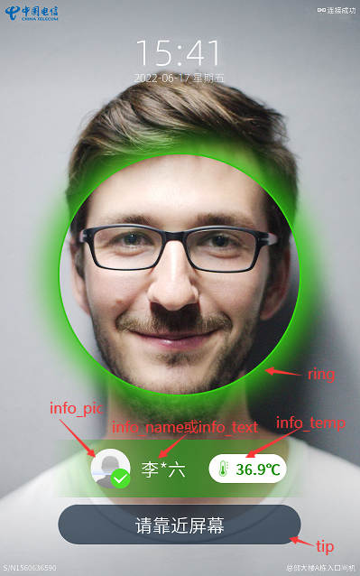
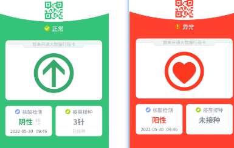
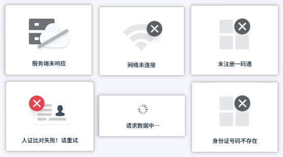

# Facerecognition

整个UI分成4个图层：

| 图层                 | 说明                                                   |
| -------------------- | ------------------------------------------------------ |
| video                | 摄像头采集的视频图像                                   |
| BaseInfoLayer        | 基础信息层，包括logo、网络状态、时间日期、序列号、位置 |
| ApertureLayer        | 光圈图层，包括人脸光圈、人员头像、人员姓名、温度       |
| DetectionResultLayer | 检测结果层，包括健康码、核酸、疫苗、错误信息           |

## 1. video

摄像头采集的视频图像，目前采用QLabel显示（video_label_）。

## 2. BaseInfoLayer

基础信息图层，包括logo、网络状态、时间日期、序列号、位置。

## 3.ApertureLayer

光圈图层包含三部分，包括人脸光圈（ring）、信息（info)和提示信息（tip）。

其中信息（info）包括人员头像（info_pic)、人员姓名(info_name)、温度(temp)。



- 该图层的整体颜色由`void set_mask_color(ApertureColor color);`控制。包含蓝色、绿色、黄色、红色。
- 各子控件的显示控制由`void set_controls_visible(ApertureLayer::Controls flag);`控制。

## 4.DetectionResultLayer

检测结果层包括检测成功后的绿码、红码、以及错误信息。通过`void set_detect_state(DetectState state);`进行控制。

```cpp
// 绿码或红码
void set_health_code(HealthCode state);
// 核酸检测状态及检测时间
void set_nucleic_acid(NucleicAcid state, const QDateTime& datetime={});
// 疫苗接种状态： [-1:**  0:未接种  1/2/3:针数]
void set_vaccination(int num);
```





